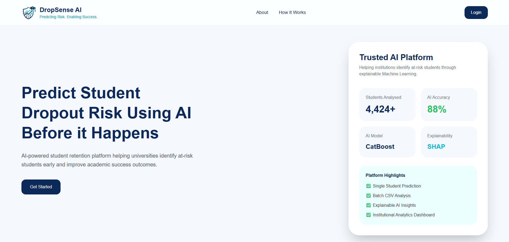
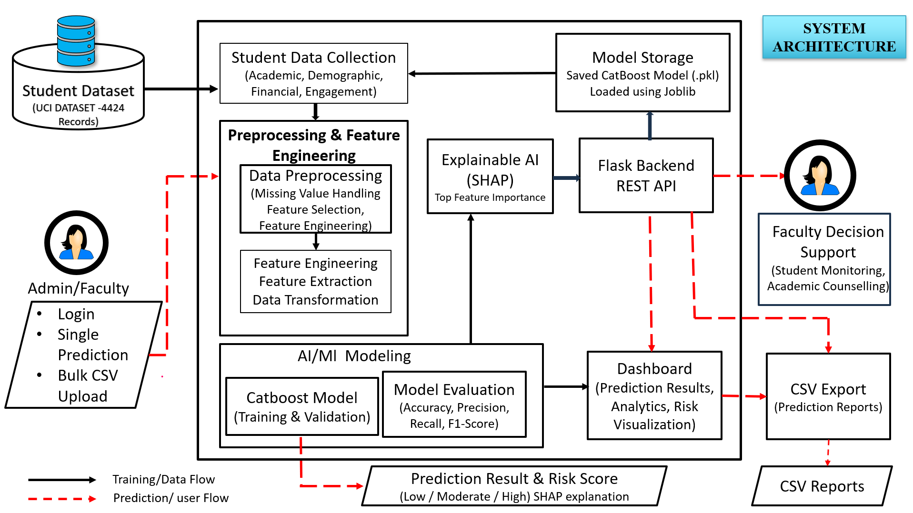
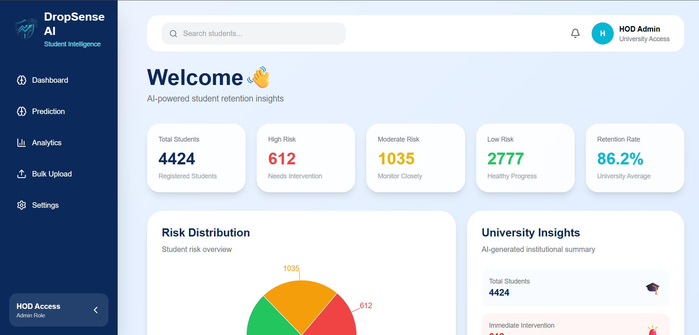
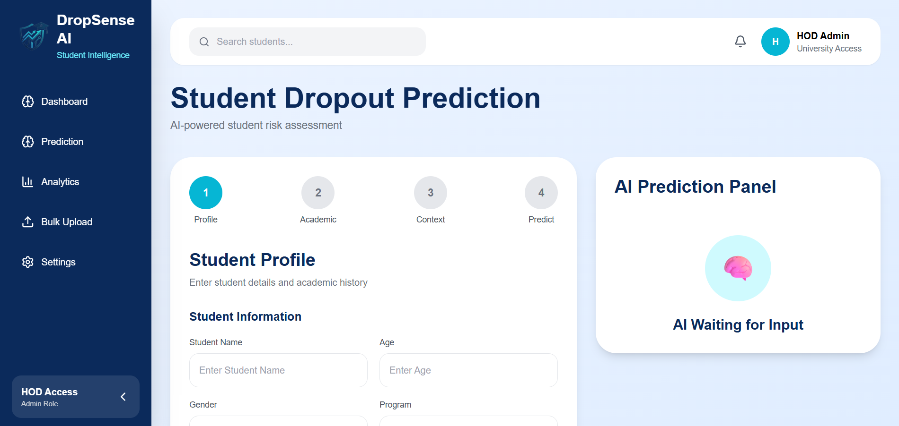
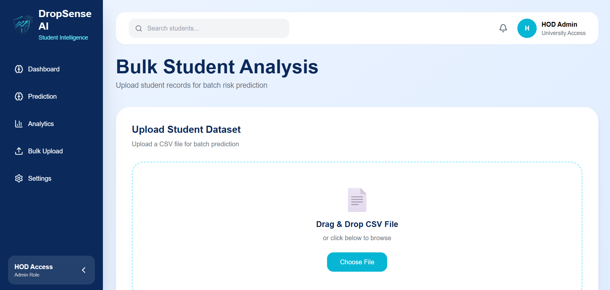
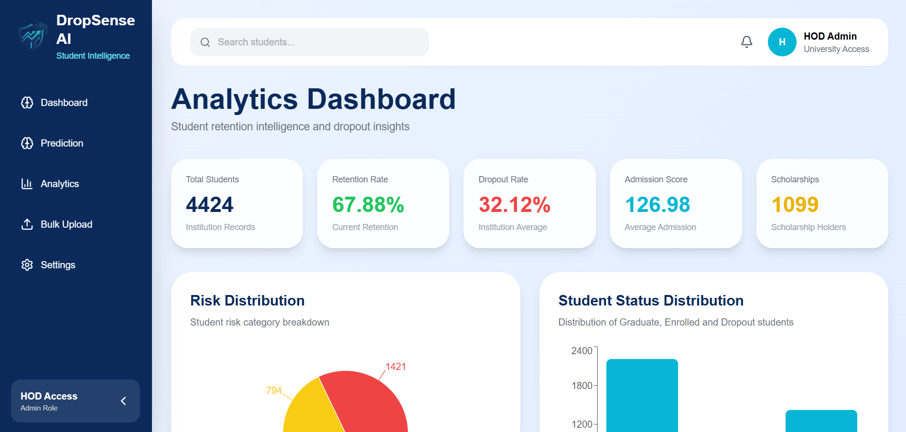

# 🎓 DropSense AI



An AI-powered student dropout prediction platform that helps educational institutions identify at-risk students early using Machine Learning and Explainable AI (SHAP). The platform supports single student prediction, bulk dataset analysis, interactive analytics, and transparent AI explanations to enable timely academic intervention.

---

## ✨ Features

- 🤖 AI-powered student dropout prediction using CatBoost.
- 📊 Interactive dashboard with institutional analytics.
- 👨‍🎓 Single student risk prediction with real-time results.
- 📂 Bulk CSV upload for batch student analysis.
- 🔍 Explainable AI using SHAP for prediction transparency.
- 📈 Risk categorization into Low, Moderate, and High Risk.
- ⚡ Fast React frontend with Flask backend integration.
- 🎨 Modern responsive user interface built with Tailwind CSS.

---

## 🛠️ Tech Stack

### Frontend

- React.js
- Vite
- Tailwind CSS

### Backend

- Flask
- Python

### Machine Learning

- CatBoost Classifier
- SHAP (Explainable AI)

### Data Processing

- Pandas
- NumPy

### Visualization

- Recharts
- Matplotlib
- Seaborn

### Development Tools

- Google Colab
- VS Code
- Git & GitHub

---

## 📂 Dataset

**UCI Machine Learning Repository**

**Predict Students' Dropout and Academic Success Dataset**

- 4,424 Student Records
- Academic Features
- Financial Features
- Demographic Features
- Student Engagement Features

---

## 🧠 Machine Learning Model

Several machine learning models were evaluated, including:

- Logistic Regression
- Random Forest
- XGBoost
- Neural Network
- **CatBoost (Final Model)**

The CatBoost classifier achieved the best overall performance and was selected for deployment due to its high predictive accuracy and robust handling of categorical features.

---

## 🏗️ System Architecture




The architecture illustrates the complete workflow of DropSense AI, from student data preprocessing and CatBoost model training to SHAP explainability, Flask backend integration, and the React-based dashboard for institutional decision support.

---

## 📸 Screenshots

### Landing Page


### Dashboard



### Single Student Prediction



### Bulk Student Analysis



### Analytics Dashboard



---

## 🚀 Installation

### Clone Repository

```bash
git clone https://github.com/priyanka350/DropSense-AI.git
```

### Frontend

```bash
cd frontend

npm install

npm run dev
```

### Backend

```bash
cd backend

pip install -r requirements.txt

python -m venv venv

venv/Scripts/activate

python app.py
```

### Login Page

- Username : admin
- Password : admin

---

## 💡 Future Scope

- Integration with University ERP/LMS systems.
- Real-time student monitoring.
- Role-based authentication.
- Email notification system.
- Cloud deployment for institutional use.
- Personalized intervention recommendations using Generative AI.

---

## Why This Project? 🤔

DropSense AI was developed to address one of the biggest challenges faced by educational institutions: identifying students who are at risk of dropping out before it is too late. By combining Machine Learning, Explainable AI (SHAP), and an intuitive web interface, the platform enables early risk prediction, transparent decision-making, and data-driven academic intervention. This project also provided hands-on experience in building and deploying a complete full-stack AI application using React, Flask, and CatBoost.

---

## Show Your Support ❤️

If you found this project useful, consider giving it a ⭐ on GitHub. It motivates me to build more AI-powered applications!

---

<p align="center">
Made with ❤️ by Priyanka Kumari
</p>

---
